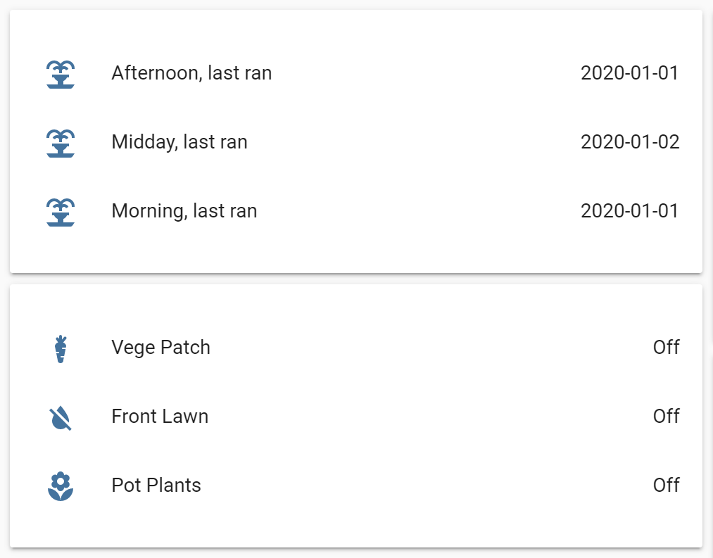

# Irrigation

The irrigation component provides the capability to control your irrigation solenoids.

When starting up or powering down the defined switches are turned off to help prevent a solenoid being left on accidentally as a result of your home assistant server having a power outage.

Programs start at the same time every day and then check their defined template to determine if watering is required. The template does not trigger the watering event.

Only one program can run at a time to prevent multiple solenoids being activated. If programs overlap the running program will be stopped.

Templates can be used to monitor conditions to prevent watering occurring. On the program this can be used to run on specific days or every 3 days or to prevent watering based on a sensor state. On zones this can be extended so watering can still occur in a covered area, or not occur if it is very windy the options are endless.

The component creates two entity types
* irrigarion - to represent a program
  - the irrigation entity store the last run day
* irrigation_zone - to represent zones
  - the irrigation_zone provides the link to the switch that controls the solenoid

## INSTALLATION
Copy the following files to the ‘config/custom components/irrigation’ directory 
* `__init__.py`
* `Manifest.json`
* `Services.yaml`

## CONFIGURATION
A irrigation section must be present in the configuration.yaml file that specifies the irrigation programs and the switches attached:
### Example configuration.yaml entry
```yaml
irrigation:
  programs:
  - name: morning
    template: "{{ now().weekday() in [0,2,4,6] }}"
    icon: mdi:fountain
    start: "07:02"
    zones:
      - zone: vege_patch
        water: 11
        wait: 1
        repeat: 2
      - zone: front_lawn
  - name: afternoon
    template: "{{ now().weekday() in [0,1,2,3,4,5,6] }}"
    start: "19:46"
    zones:
      - zone: vege_patch
      - zone: front_lawn

  zones:
  - name: Vege Patch
    water: 1
    wait: 1
    repeat: 2
    switch_entity: switch.station_1_solenoid
    icon_off: 'mdi:carrot'
  - name: front lawn
    water: 1
    switch_entity: switch.station_2_solenoid
```
## CONFIGURATION VARIABLES

### programs
*(list)(Required)* a list of programs to run
#### name
*(string)(Required)* This is the name given to the irrigation entity
#### template
*(template)(Optional)* Allows a value_template to defer watering on the program. If defined watering will occur when the template evaluates to True. If not provide program will activate every day.
#### icon
*(icon)(Optional)* This will replace the default icon.
#### start
*(time)(Required)* This is the start time of the program. Format "hh:mm".
#### Zones 
*(list)(Required)* the list of zones to sequentially water
#### zone
*(entity)(Required)* This is the name given to the irrigation_zone entity.
#### water
*(int)(Optional)* This it the period that the zone will turn the switch_entity on for. Range 1 to 30 minutes. Defaults to the zone specification if not provided.
#### wait
*(int)(Optional)* This provides for an Eco capability implementing a cycle of water/wait/repeat to allow water to soak into the soil. Range 1 to 30 minutes. Defaults to the zone specification if not provided.
#### repeat
*(int)(Optional)* This is the number of cycles to run water/wait. Range 1 to 30. Defaults to the zone specification if not provided.
### zones
*(list)(Required)* a list of zone to operate
#### name
*(string)(Required)* This is the name given to the irrigation_zone entity
#### water
*(int)(Required)* This it the period that the zone will turn the switch_entity on for. Range 1 to 30 minutes.
#### wait
*(int)(Optional)* This provides for an Eco capability implementing a cycle of water/wait/repeat to allow water to soak into the soil. Range 1 to 30 minutes.
#### repeat
*(int)(Optional)* This is the number of cycles to run water/wait. Range 1 to 30.
#### template
*(template)(Optional)* Allows a value_template to defer watering on a zone. If defined watering will occur when the template evaluates to True.
#### switch_entity
*(entity)(Required)* The switch to operate when the zone is triggered.
#### icon_on
*(icon)(Optional)* This will replace the default icon mdi:water.
#### icon_off
*(icon)(Optional)* This will replace the default icon mdi:water-off.
#### icon_wait
*(icon)(Optional)* This will replace the default icon mdi:timer-sand.

## SERVICES
```
run_program:
    description: Run a defined irrigation program.
    fields:
        entity_id:
            description: The program to manually run, template evaluation is ignored.
            example: 'irrigation.morning'

run_zone:
    description: Run a defined irrigation program.
    fields:
        entity_id:
            description: The zone to manually run, template evaluation is ignored.
            example: 'irrigation_zone.vege_patch'
        water:
            description: Otional - Minutes to water.
            example: 1
        wait:
            description: Optional - Minutes to delay between repetitions.
            example: 1
        repeat:
            description: Optional - Run water/wait cycle this many times.
            example: 5

stop_programs:
    description: Stop any running programs or stations.
```

## TEMPLATE EXAMPLES
both of these templates provide the same result for watering on defined days
```
"{{ now().weekday() in [0,2,4,6] }}"
"{{ now().strftime('%a') in ['Mon','Wed','Fri','Sun'] }}"
```
Water every three days
```
"{{ state_attr('irrigation.morning', 'days_since') > 2 }}"
```

Check sensor values
```
{{ now().weekday() in [0,1,2,3,4,5,6] and states('binary_sensor.is_wet') == 'off' }}
{{ is_state('binary_sensor.is_wet','off') }}
{{ states('binary_sensor.is_wet') == 'off' }}
```
## REVISION HISTORY
0.1
•	Initial release

